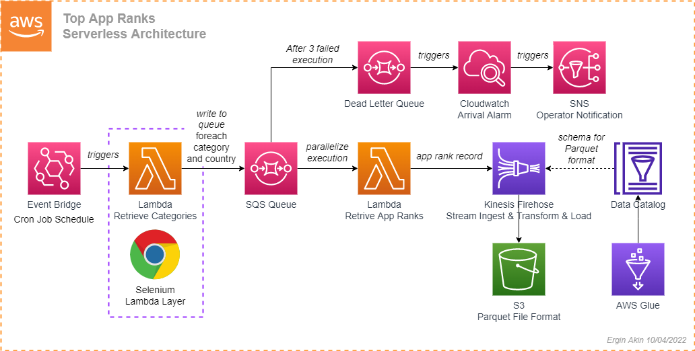

# Scalable App Store Crawler

Collecting public data from the app stores.

### Deployment

Requirements
- AWS CLI installed & configured (https://docs.aws.amazon.com/cli/latest/userguide/getting-started-install.html)
- Serverless Framework (https://www.serverless.com/framework/docs/getting-started)
- Selenium Lambda Layer is not included in the configuration, manual creation is required (https://dev.to/awscommunity-asean/creating-an-api-that-runs-selenium-via-aws-lambda-3ck3)

`sls deploy`

